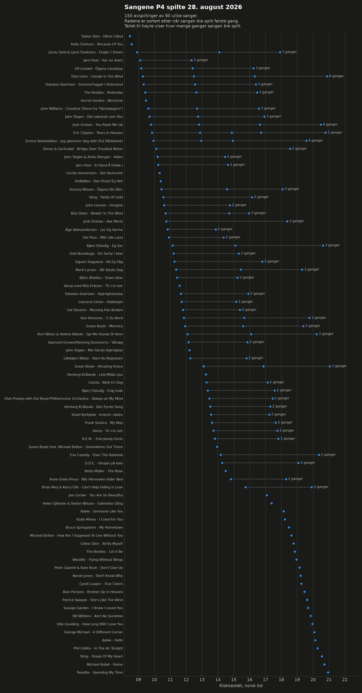
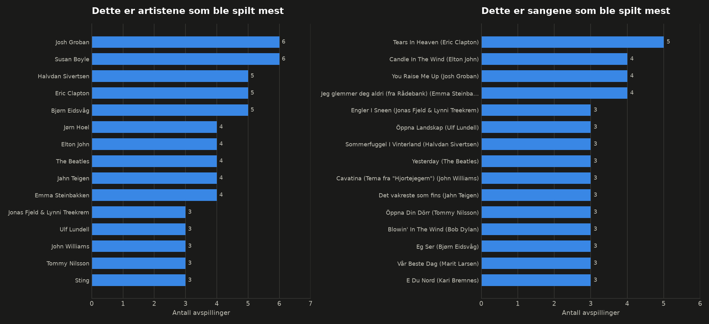
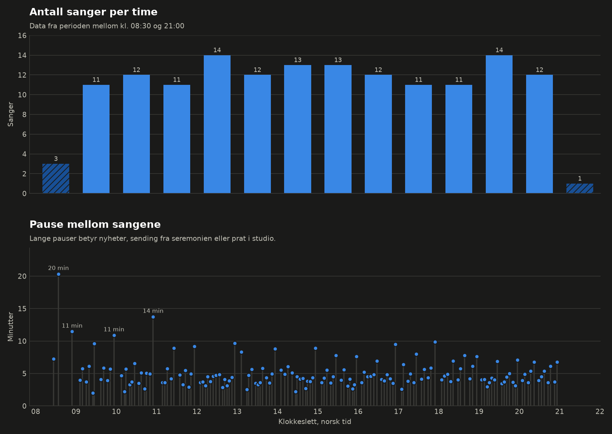

# P4 landesorg spilleliste, 28. august 2026

Kong Harald V gikk bort 28. august 2026. P4 la om sendingen samme dag og spilte
en egen spilleliste fra morgen til kveld.

Her er spillelisten slik den ble sendt fra kl. 08:30 til kl. 21:00

## Datasettet

`p4-2026-08-28-0830-2100.csv`

| kolonne | innhold |
| --- | --- |
| `time_oslo` | tidspunkt, norsk lokaltid |
| `artist` | artist |
| `title` | sang |
| `spotify` | Spotify-id, hvis den finnes |
| `youtube` | YouTube-lenke, hvis den finnes |

150 avspillinger av 80 ulike sanger. Første sang 08:26, siste 21:02.

## Grafene

Hver rad er én sang. Hvert punkt er én avspilling.



Artistene og sangene som ble spilt oftest.



Antall sanger per time, og hvor lange pausene mellom sangene var.



Grafene finnes både i lys utgave (`charts/`) og mørk utgave (`charts/dark/`).

## Kjør

```bash
uv run visualize.py
```

